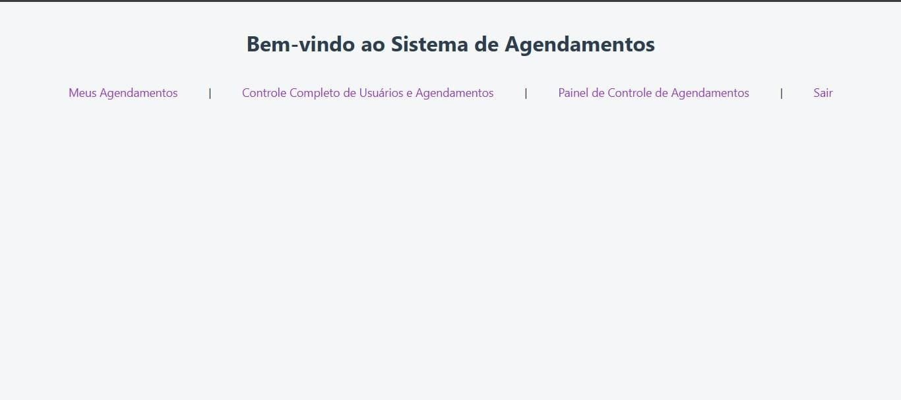

# Sistema Web de Agendamento com Perfis de Usuário

Bem-vindo ao sistema que permite agendamentos para Clientes, Atendentes e Administradores...

## 🎯 Objetivo

Atividade de pratica para Desenvolver um sistema web completo de agendamentos que permita a interação de diferentes perfis de usuários: **Clientes, Atendentes e Administradores**. O sistema possibilita o agendamento, gerenciamento e acompanhamento de compromissos, com **autenticação de acesso, controle de permissões**.

---

## ✅ Requisitos Funcionais

### 🔐 Acesso e Perfis

- Tela de login com autenticação e redirecionamento por perfil.
- Perfis de usuários:
  - **Cliente**
  - **Atendente**
  - **Administrador**
- Cadastro de novos usuários (feito exclusivamente por administradores).

### 📅 Agendamento

#### Cliente
- Visualiza seus próprios agendamentos.
- Cria novos agendamentos.
- Consulta histórico.

#### Atendente
- Visualiza todos os agendamentos.
- Marca agendamentos como concluído ou cancelado.

#### Administrador
- Gerencia todos os usuários (cadastro, edição e exclusão).
- Acompanha, altera e exclui agendamentos.
- Acessa painéis com relatórios e estatísticas.

---

## 📄 Funcionalidades por Página

- **Login:** Autenticação com redirecionamento conforme o perfil do usuário.
- **Cadastro de Usuário:** Acesso restrito ao administrador.
- **Página de Agendamentos (Cliente):** Criação, listagem e histórico.
- **Controle de Agendamentos (Atendente/Admin):** Filtros, edição e atualização de status.
- **Dashboard (Administrador):** Relatórios e visão geral dos agendamentos.

---

## 🛠 Tecnologias Utilizadas

- **Frontend:** HTML5, CSS3, JavaScript
- **Backend:** Node.js com Express
- **Banco de Dados:** MySQL
- **Controle de Versão:** Git e GitHub
